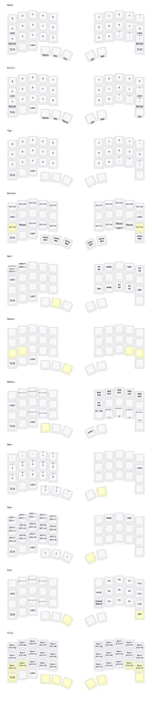

# Keyball39 ZMK configuration

Custom Miryoku firmware for a Keyball39 with two nice!nano + nice!view
peripheral halves, a XIAO BLE USB dongle, and a PMW3610 trackball.

Automouse is intentionally disabled. Pointer movement is always explicit;
BUTTON provides precision movement and MOUSE provides scroll mode. See
[MIRYOKU.md](MIRYOKU.md) for layers, recovery controls, building, and flashing.

## Credits

- PCB: [yangxing844](https://github.com/yangxing844)
- Case: [delock](https://github.com/delock)
- Original firmware: [Amos698](https://github.com/Amos698)
